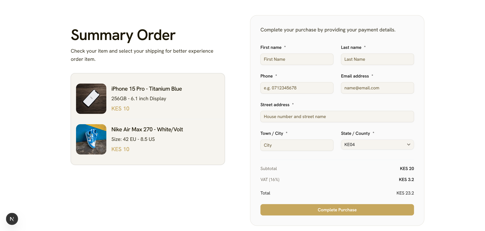
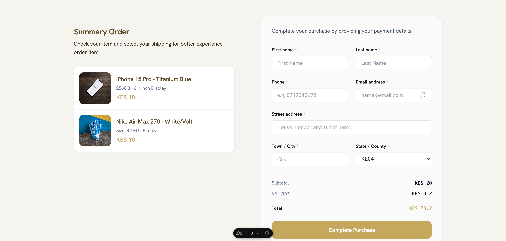
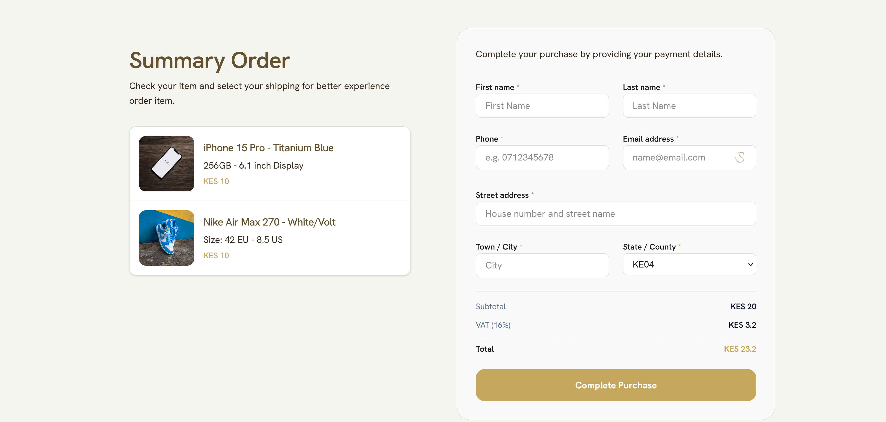

# Pesapal TypeScript Library

A pure, dependency-free TypeScript library for the PesaPal API v3 using the standard Web Fetch API. Designed to work flawlessly in frontend frameworks like Next.js, Nuxt.js, SvelteKit (server routes) or standard Node.js applications (v18+).

The library was created to ease the usage of PesaPal payments in modern TypeScript/JavaScript environments.

> [!WARNING]
> Consumer Keys and Secrets should never be exposed to the browser. Only use this library inside secure server-side routes (like Next.js API Routes or Server Actions).

##  📸 Showcase

The library comes with three beautiful, ready-to-use examples for popular frameworks. They all share the same premium UI and robust payment logic.

| [Next.js Example](./examples/nextjs-example) | [Nuxt.js Example](./examples/nuxt-example) | [SvelteKit Example](./examples/sveltekit-example) |
| :---: | :---: | :---: |
|  |  |  |

##  Resources

To help you get started quickly, here are some useful links:

- **Official Documentation:** [https://developer.pesapal.com/](https://developer.pesapal.com/)
- **Postman Collection:** [Official PesaPal V3 Postman](https://documenter.getpostman.com/view/6715320/UyxepTv1)
- **Test Credentials:** [Sandbox Demo Keys](https://developer.pesapal.com/api3-demo-keys.txt)

##  Installation

```bash
npm install pesapal-ts
```

*(Since you are developing locally, you can use `npm link` or copy this package directly to your project)*

##  Usage

### 1. Initialize the client

```ts
import { PesapalClient } from 'pesapal-ts';

const pesapal = new PesapalClient({
  consumerKey: process.env.PESAPAL_CONSUMER_KEY!,
  consumerSecret: process.env.PESAPAL_CONSUMER_SECRET!,
  environment: 'sandbox', // Use 'production' for live apps
});
```

### 2. Authenticate & Register IPN

```ts
// Authenticate
await pesapal.authenticate();

// Register your server's IPN URL for instant payment notifications
const ipn = await pesapal.registerIPN({
  url: "https://your-domain.com/api/pesapal-webhook", // Must be publicly accessible
  ipn_notification_type: "GET" 
});

const ipnId = ipn.ipn_id;
console.log('IPN Registration ID:', ipnId);
```

### 3. Create an Order (Checkout)

```ts
const orderResponse = await pesapal.submitOrder({
  id: "YOUR_UNIQUE_ORDER_ID_123",
  currency: "KES",
  amount: 100.0,
  description: "Test Purchase",
  callback_url: "https://your-domain.com/payment-success",
  notification_id: ipnId, // From previous step
  billing_address: {
    email_address: "john.doe@example.com",
    phone_number: "0712345678",
    country_code: "KE",
    first_name: "John",
    last_name: "Doe"
  }
});

// Redirect user to the PesaPal checkout page
console.log('Redirect user to:', orderResponse.redirect_url);
```

### 4. Verify Transaction Status

When a transaction is completed, PesaPal redirects the user and/or calls your IPN URL with an `OrderTrackingId` parameter. Use it to check status:

```ts
await pesapal.authenticate(); // Ensure you're still authenticated
const status = await pesapal.getTransactionStatus('ORDER_TRACKING_ID_HERE');

if (status.payment_status_code === 'COMPLETED') {
  // Update your database!
  console.log('Payment Successful:', status);
}
```

##  Framework Setup

We have provided ready-to-use examples for popular frameworks. Each example includes a shared `CheckoutForm` component and secure API routes.

### [Next.js Example](./examples/nextjs-example)
1. **API Integration**: Implements App Router API routes (`app/api/checkout/route.ts`) to securely initialize payments.
2. **Components**: Uses Shadcn-inspired UI components for a premium look and feel.
3. **Setup**:
   - Copy `.env.example` to `.env` and add your PesaPal keys.
   - Run `pnpm install && pnpm dev`.

### [Nuxt.js Example](./examples/nuxt-example)
1. **Server Routes**: Uses Nitro server routes (`server/api/checkout.post.ts`) for server-side logic.
2. **Vue Integration**: Features a reactive `CheckoutForm.vue` component with Tailwind CSS.
3. **Setup**:
   - Add keys to `.env` or `runtimeConfig` in `nuxt.config.ts`.
   - Run `pnpm install && pnpm dev`.

### [SvelteKit Example](./examples/sveltekit-example)
1. **Server Actions**: Leverages SvelteKit Form Actions (`+page.server.ts`) for seamless form submission.
2. **Modern Styling**: Uses Svelte with Tailwind CSS for a fast and beautiful experience.
3. **Setup**:
   - Define keys in `.env` (accessed via `$env/static/private`).
   - Run `pnpm install && pnpm dev`.

##  Error Handling

The library provides comprehensive error classes to help you easily debug and handle failures at different stages.

```ts
import { 
  PesapalClient,
  PesapalAuthenticationError,
  PesapalValidationError,
  PesapalAPIError,
  PesapalNetworkError
} from 'pesapal-ts';

try {
  await pesapal.submitOrder(payload);
} catch (error) {
  if (error instanceof PesapalValidationError) {
    console.error("Missing fields or bad input data:", error.message);
  } else if (error instanceof PesapalAuthenticationError) {
    console.error("Token invalid or expired:", error.message);
  } else if (error instanceof PesapalAPIError) {
    console.error("PesaPal API returned an error:", error.message, error.response);
  } else if (error instanceof PesapalNetworkError) {
    console.error("Fetch request failed totally (e.g. timeout)", error.message);
  } else {
    console.error("An unknown error occurred", error);
  }
}
```

##  Features

- **Dependency-free**: Pure TypeScript using native Fetch API.
- **Edge Runtime compatible**: Works on Cloudflare Workers, Vercel Edge, etc.
- **Fully Typed**: Catch errors at compile-time with complete type definitions.
- **Rich Documentation**: Comprehensive JSDoc comments for all methods and types.
- **Sandbox & Production**: Easy toggling between environments.
